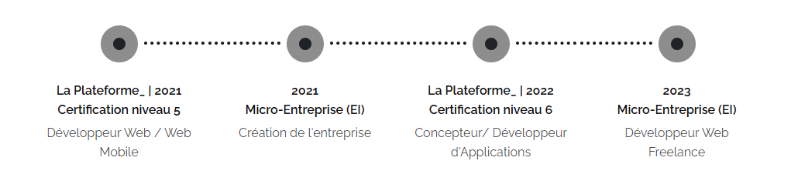

  

###

<h1 align="center">Bonjour à tous 👋</h1>

###

  

###

  
  
  
  

###

<h2 align="left">👩‍💻  Qui Suis-Je ?</h2>

###

Basé à Martigues dans les Bouches-du-Rhône, j'accompagne de grandes entreprises, PME, indépendants, startups, associations et particuliers dans le développement de leur présence digitale.  Qu'est-ce qui me distingue ? La passion. J'élabore des stratégies qui sont adaptées à vos objectifs et votre budget. Création de sites vitrine, sites internet sur-mesure, ou encore boutiques en ligne (e-commerce) : mes services sont à votre disposition pour concevoir avec vous votre projet à votre image.

###

<h2 align="left">💼 Mon Parcours</h2>

###

Fort d'un parcours professionnel riche, je suis passionné par le web. Mon engagement envers l'excellence se traduit par des services de qualité que je vous propose, me positionnant ainsi comme le collaborateur idéal pour répondre à vos besoins.   Qu'est-ce qui me distingue ? La passion. J'élabore des stratégies qui sont adaptées à vos objectifs et votre budget. Création de sites vitrine, sites internet sur-mesure, ou encore boutiques en ligne (e-commerce) : mes services sont à votre disposition pour concevoir avec vous votre projet à votre image.

###

  

###

<h2 align="left">🌐 Mes Services</h2>

###

<h3 align="left">💎 Engagement 💎</h3>

###

Avec l'opportunité de pouvoir choisir les projets sur lesquels je travaille, c'est avec passion et détermination que je m'implique dans la réussite de votre projet en déployant tout les moyens nécessaires à son bon déroulement de la conception jusqu'à la livraison de votre projet.

###

<h3 align="right">⚡Efficacité⚡</h3>

###

Je ne prends pas plusieurs projets à la fois, cela me permet d'être plus efficace sur vos demandes et d'être concentré sur votre projet. Je m'investis à 100% et m'engage à vous livrer les éléments, comme défini dans le cahier des charges en amont du développement.

###

<h3 align="left">📞 Accompagnement 📞</h3>

###

En passant par mes services, vous profitez des avantages d'une agence web mais en ne vous adressant qu'à moi! En découle donc un meilleur échange et l'information circule mieux. De plus, vous bénéficiez d'un suivi personnalisé sur votre projet, efficacité assurée !

###

<h2 align="left">🎯 Mes Skills</h2>

###

  
  
  
  
  
  
  
  
  
  
  
  
  
  
  
  
  
  
  
  
  
  
  
  
  
  
  
  
  
  
  
  
  
  
  
  
  
  
  
  
  
  
  
  
  
  
  
  
  
  
  
  
  
  
  
  
  
  
  
  
  
  
  
  
  
  
  

###

  

###

###
