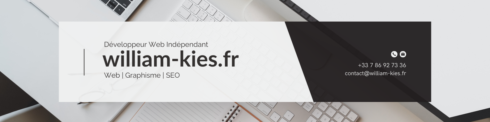

  

###

  
  

###

<h1 align="center">Bonjour à tous 👋</h1>

###

<h3 align="left">👩‍💻  Qui Suis-Je ?</h3>

###

  Basé à Fos-sur-Mer dans les Bouches-du-Rhône, j'accompagne de grandes entreprises, PME, indépendants, startups, associations et particuliers dans le développement de leur présence digitale.

  Qu'est-ce qui me distingue ? La passion. J'élabore des stratégies qui sont adaptées à vos objectifs et votre budget. Création de sites vitrine, sites internet sur-mesure, ou encore boutiques en ligne (e-commerce) : mes services sont à votre disposition pour concevoir avec vous votre projet à votre image.

###

<h3 align="left">💼  Mon Parcours</h3>

###

  Fort d'un parcours professionnel riche, je suis passionné par le web. Mon engagement envers l'excellence se traduit par des services de qualité que je vous propose, me positionnant ainsi comme le collaborateur idéal pour répondre à vos besoins.

###

 

###
